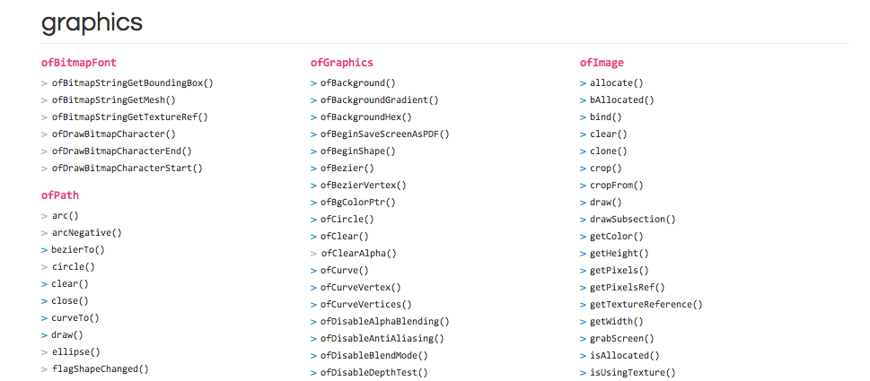

#Week 4

##Coordinate review

0, 0 starts at the top left-hand side of the .app window

##Drawing and Playing
We will spend the rest of the day experimenting with openFramework's graphics functions paying special attention to:

- ofSetBackgroundColor()
- ofSetBackgroundAuto()
- ofFill()
- ofNoFill()
- ofSetColor()
- ofLine()
- ofRect()
- ofTriangle()
- ofBeginShape()
- ofVertex()
- ofEndShape() 
- ofPushMatrix()
- ofRotate()
- ofPopMatrix()

##Links
- [ofGraphics Documentation](http://www.openframeworks.cc/documentation/graphics/ofGraphics.html#!show_ofSetBackgroundColor)

##Homework for next class
- Read the in-progress [Intro To Graphics](https://github.com/openframeworks/ofBook/blob/master/20_intro_to_graphics/chapter.md) chapter from ofBook.
- Create 2 drawings using variables and the OpenFrameworks drawing functions. These drawings can be static or use your knowledge of programming motion to create a moving sketches.