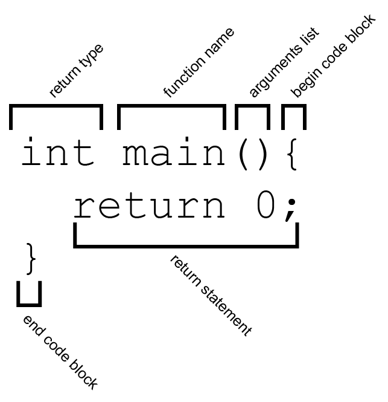

# Week 4

## Loops and conditionals

`if`, `if else`, `else`, `for`, `while`, and `do while`.

## Functions

Reuse, reuse, reuse!



```cpp

void testApp::setup() {
    greet("moon");
    greet("red balloon");
    greet("comb");
    greet("brush");
    greet("bowl full of mush");
    return 0;
}

void testApp::greet(string person){
    cout << "Good night " << person << "." << endl;
}

```


## Links
- [Helpful Introduction to basics of oF](http://www.openframeworks.cc/tutorials/introduction/001_chapter1.html)

## Homework for next class
- Re-read the __newer__ version of [C++ Basics](https://github.com/openframeworks/ofBook/blob/master/20_intro_to_graphics/chapter.md). Take notes, especially of confusing terms and practices.
- Create a sketch that uses loops, conditionals, and mouse interaction.