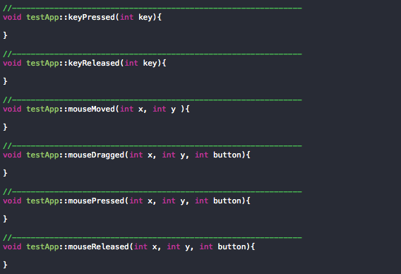

# Week 4

## Interaction

### Basics

- Mouse Press
- Mouse Release
- Mouse Movement
- Mouse Drag
- Key Press
- Key Release

### Advanced

Advanced inputs can offer an analog-like gradient value rather than a simple boolean.

- Camera Input
- Audio Input
- Touch Screen
- Custom sensors

## Homework for Next Week
Create a sketch that utilizes loops, conditionals, and at least two user interactions.