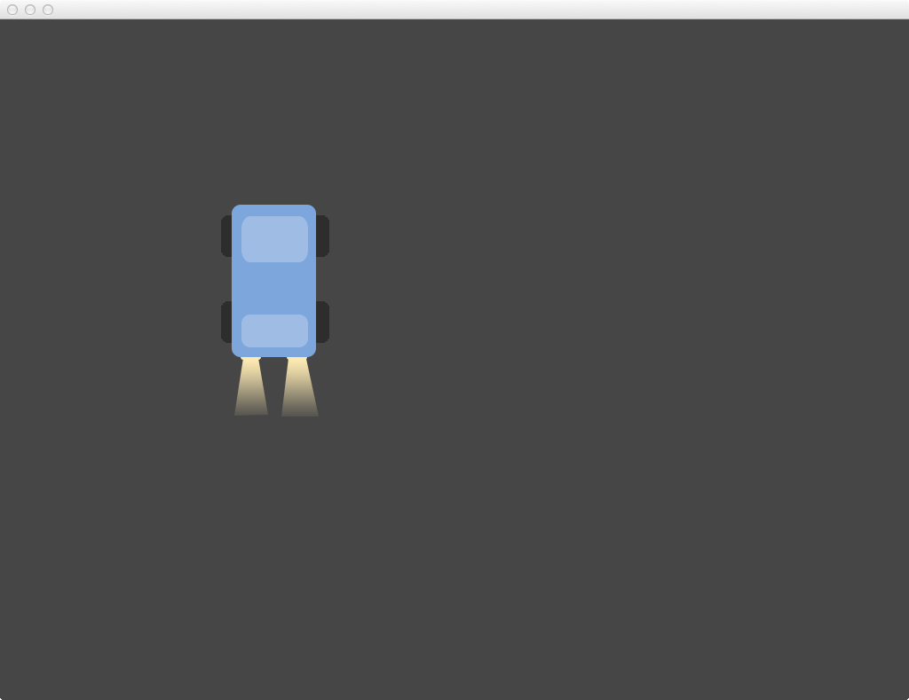

## Arrays & Putting it all together

Today we will extend our car example to have:

- Variable car properties (i.e. speed, size)
- Smoother Controls
- Rotating Car
- Bot Cars

## Homework
- Create one sketch that uses:
	- A custom class (not `Ball` or `Car`).
	- An array of instances of the custom class.
	
Please e-mail me an outline of what class you will build, and you want the sketch to do, by Wednesday night.

- Please read and take notes on the ofBook [Animation chapter](https://github.com/openframeworks/ofBook/blob/master/04_animation/chapter.md). Write down at least three questions that you have while reading the chapter.